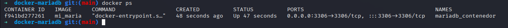
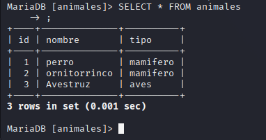

# MARIA DB EN UN CONTENEDOR

Utilizando como base la imagen de maria db construimos una imagen utilizando docker file

## Construcción de la imagen Docker

En el [Dockerfile](./Dockerfile) definimos las credenciales de usuario para nuestra base de datos y el nombre de esta. adicionalmente copiamos el archivo init.sql a nuestra imagen, el cual se ejecutara al momento de arrancar nuestro contenedor por primera vez y este archivo crea una tabla "animales" y le agrega 3 entidades a la tabla


## Creacion y ejecucion del contenedor

creamos y corremos el contenedor "mariadb_contenedor utilizando la imagen que construimos "mi_maria" y mapeamos al puerto del host **3306**


ejecutamos el comando de

```bash
docker ps
```

Tenemos el siguiente resultado:



## Probar de la base de datos en el contenedor

Nos conectamos al cliente de MariaDb incluido en su imagen

```bash
docker exec -it mariadb_contenedor mariadb -u maria -pmaria18 animales
```

y corremos la siguiente consulta

```bash
SELECT * FROM animales;
```

tenemos el siguiente resultado:


